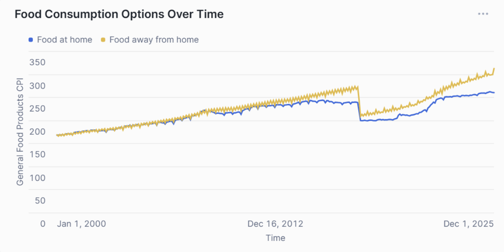
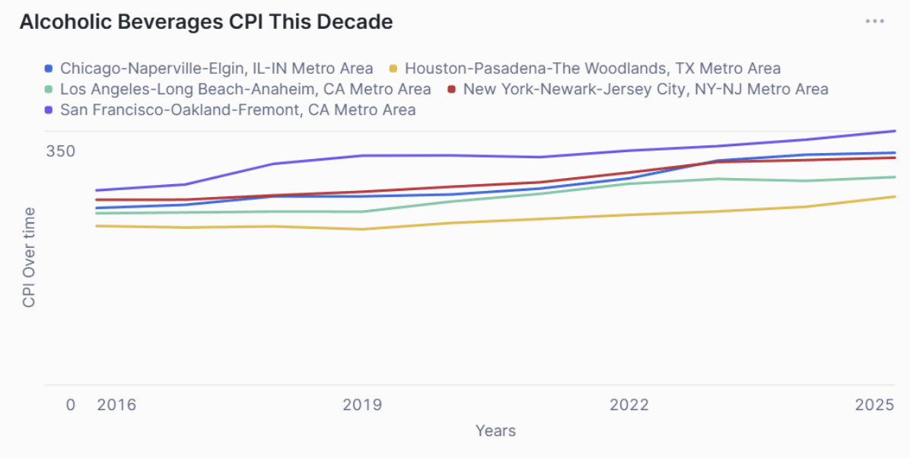
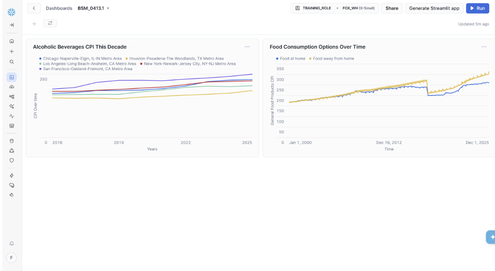
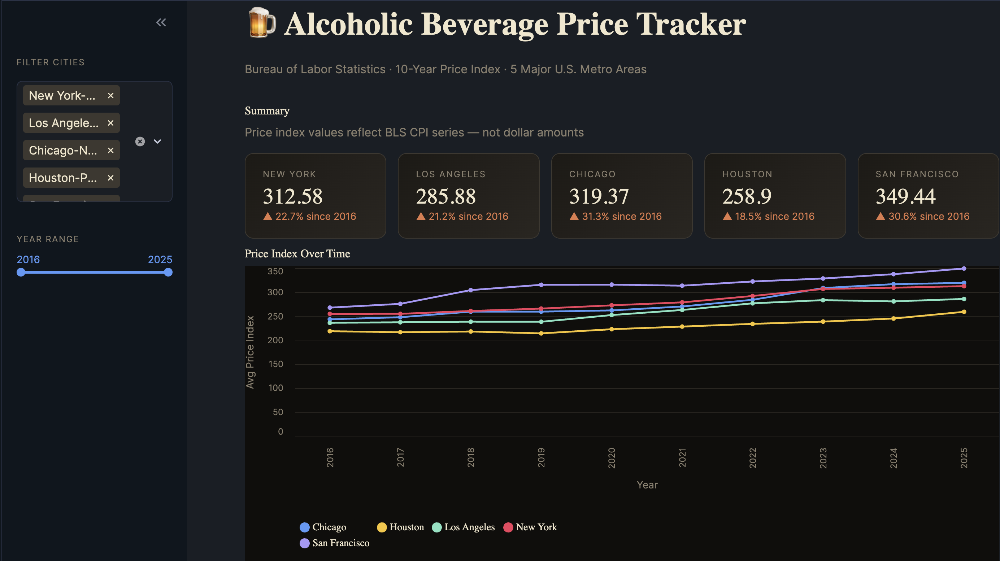
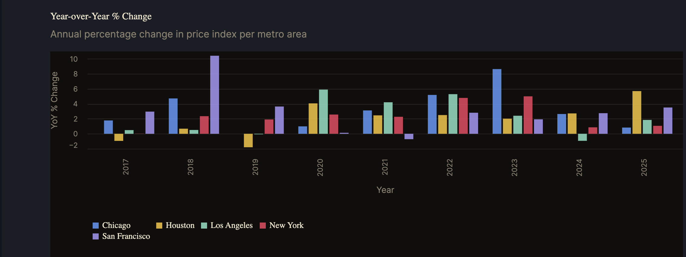
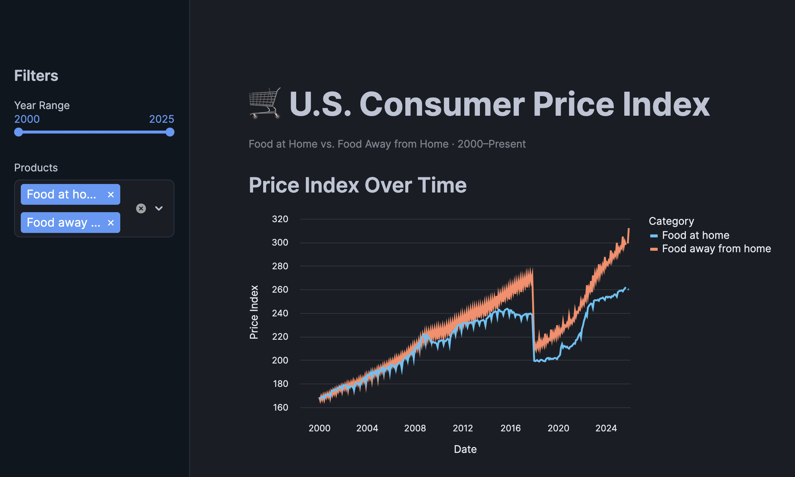
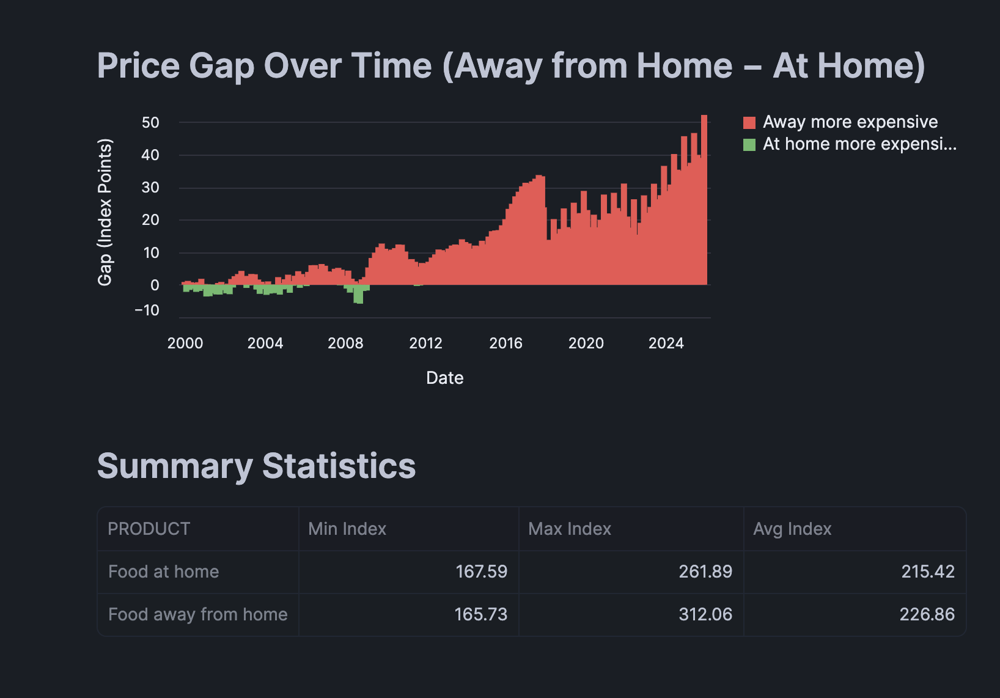

## Team Name: 

71552 Group 5
## Team Members:

1. Brian Michaels - https://github.com/bmichaels914/4610-Group-5-Project-1/blob/55e44c0680e301e1a109035a9557309b69cff217/README.md
2. Kush Konduru (Owner)
3. Pierce Jennings - https://github.com/PierceJ-MIS/4610-Group-5-Project-1/blob/c1464054eed714c5429824d215c0d16218bbc2db/README.md
4. Simran Kansara - https://github.com/simrankansara2028/4610-Group-5-Project-1/blob/ab6f804d2c6ac0af37a628b9b025cb2357b9732c/README.md
5. Rohan Reddy - https://github.com/rohanreddy0205-debug/4610-Group-5-Project-1/blob/ab6f804d2c6ac0af37a628b9b025cb2357b9732c/README.md

## Dataset Descriptions: 

Provider: Bureau of Labor Statistics (BLS)
Marketplace Listing Name: Snowflake Public Data

We chose the BLS database because it provides a wide range of pricing and Consumer Price Index (CPI) data across many industries such as food, beverages, housing, healthcare, and education. This makes it highly useful for business analysis because it allows us to study inflation trends, consumer behavior, and regional price differences.

The BLS database contains 12 tables. For this project, we used three main tables: BLS CPI Statistics Timeseries, BLS CPI Statistics Attributes, and the Geography Index table.

## Tables Used

### BLS CPI Statistics Timeseries
Rows: 1,429,988
This table stores the monthly CPI values and price measurements over time.

Key Columns and Data Types:

GEO_ID — VARCHAR
VARIABLE — VARCHAR
VARIABLE_NAME — VARCHAR
VALUE — FLOAT
DATE — DATE

### BLS CPI Statistics Attributes
Rows: 2,290
This table provides descriptions for each CPI variable and helps identify products and reporting categories.

Key Columns and Data Types:

VARIABLE — VARCHAR
VARIABLE_NAME — VARCHAR
UNIT — VARCHAR
REPORT — VARCHAR
PRODUCT — VARCHAR

### Geography Index Table
Rows: 573,263
This table connects GEO_ID values to readable geographic locations such as metro areas and cities.

Key Columns and Data Types:

GEO_ID — VARCHAR

These tables were joined together to analyze alcoholic beverage prices across metro areas and compare food-at-home versus food-away-from-home price trends over time.
## Questions and Justification: 

### Question 1

How have alcoholic beverage prices trended year-over-year across the five largest U.S. metro areas over the past decade, and which cities have experienced the most volatile or consistently high price growth?

Alcoholic beverage prices are part of the CPI, so tracking year-over-year changes helps show inflation differences across major metro areas. Comparing cities helps identify where prices rise faster and where inflation is more volatile. This is useful for consumers and for businesses like restaurants, bars, and retailers when making pricing decisions.

Columns and Tables Used

Tables: Geography Index, BLS CPI Timeseries, BLS CPI Attributes

Relevant Columns:

GEO_NAME — metro areas being compared
PRICE_YEAR — year for trend analysis
AVG_PRICE — average alcoholic beverage CPI for that city/year
YOY_PCT_CHANGE — yearly percent change in price

### Question 2

Has the price gap between eating out and buying groceries grown or shrunk since 2000, and how did major economic shocks like the 2008 recession and 2020 pandemic affect each differently?

Food prices are a major part of household spending, so comparing groceries and eating out helps show changes in cost of living. Studying the price gap shows how events like the 2008 recession and 2020 pandemic affected both categories differently. This helps families understand spending changes and helps businesses adjust pricing strategies.

Columns and Tables Used

Tables: BLS CPI Timeseries, BLS CPI Attributes

Relevant Columns:

MONTH — monthly time period for analysis
PRODUCT — Food at home or Food away from home
PRICE — average monthly CPI value
GAP — difference between restaurant food and grocery prices

## Data Manipulations: 

### Question 1: 
The project joined three BLS tables: price timeseries, price attributes, and geography index to connect yearly alcoholic beverage CPI data with the correct product and metro area names. It filtered for only “Alcoholic beverages,” the last 10 years, and five major metro areas: New York, Los Angeles, Chicago, Houston, and San Francisco. The data was grouped by year using YEAR(t.DATE) and average prices were calculated using AVG(t.VALUE). A LAG() window function was then used to calculate year-over-year percentage change for each city, making it easier to compare which metro areas had the steepest or most volatile price growth. 

### Question 2: 

The project joined the BLS price timeseries table with the price attributes table to connect monthly CPI data with the correct food categories. It filtered for only “Food at home” and “Food away from home” starting from the year 2000 to compare long-term food price trends. The data was grouped by month using DATE_TRUNC('MONTH', t.DATE) and average prices were calculated using AVG(t.VALUE). A calculated field called GAP was created by subtracting Food at Home prices from Food Away from Home prices so the difference between grocery and restaurant food costs could be compared more clearly.

## Dashboard Analysis and Results:

From 2000 through roughly 2020, grocery and restaurant prices rose almost identically, meaning the cost gap between eating at home and eating out stayed narrow and stable for two decades. After 2020, however, restaurant prices pulled sharply ahead, ending about 45 CPI points higher than groceries by 2025. This has been the widest divergence in the entire 25-year window. The gap has clearly widened, driven by the heavier labor and operational cost pressures that hit the food service industry harder than grocery retail in the post-pandemic period.

All five metros trended upward over the decade, but San Francisco stood out as both the highest-priced and fastest-growing market, pulling away from the pack to reach a CPI of roughly 365 by 2025. Houston was the clear outlier on the opposite end, remaining the flattest and lowest-priced throughout the entire period. New York and Chicago converged near the top by 2025, while Los Angeles grew steadily in the middle, making San Francisco the answer to which city saw the most consistently high alcoholic beverage price growth.

## Streamlit App:

### Question 1: 

The first question uses a line chart to show long-term alcoholic beverage price trends across five metro areas and a bar chart to show year-over-year percentage changes, helping identify which cities had the steepest and most consistent increases. Interactive city and year filters, summary metric cards, and hover tooltips make it easier to compare locations and focus on specific time periods.

### Question 2:

The second question uses a line chart to compare Food at Home and Food Away from Home price trends over time and a bar chart to measure the price gap between them. Interactive year and product filters, along with tooltips, help users analyze how events like the 2008 recession and 2020 pandemic affected both categories differently and whether the gap has grown.

